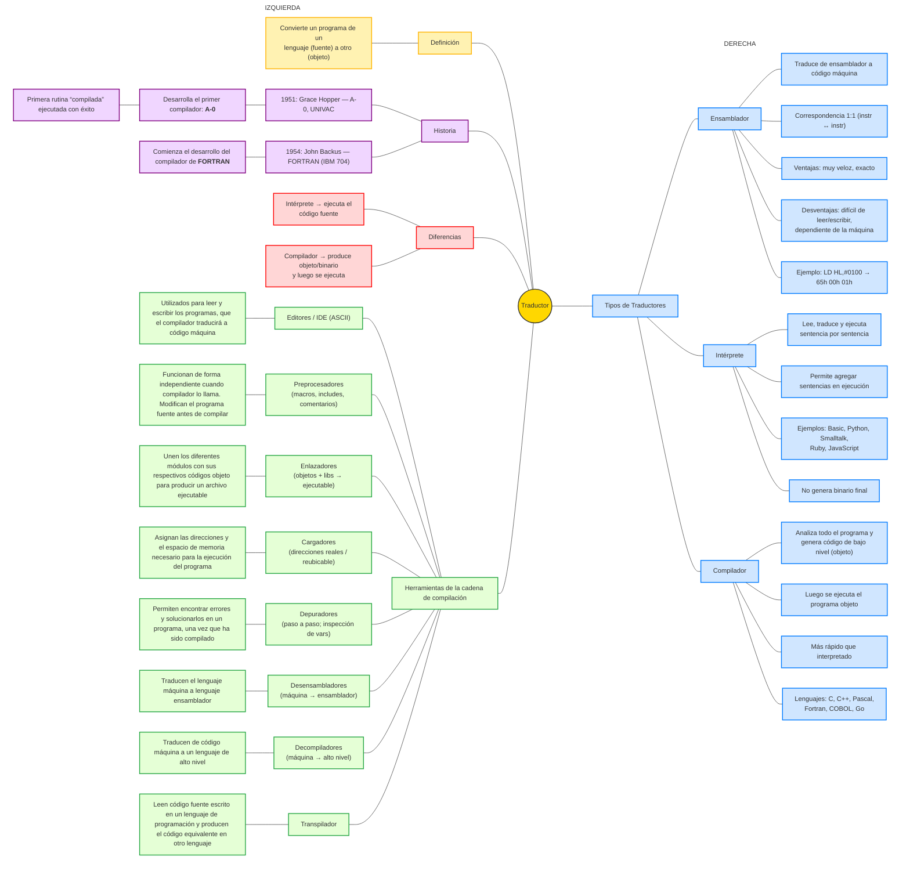

# Parseo

### TP 1 - Mapa Mental

```mermaid
graph LR
    %% =============== NODO CENTRAL ===============
    A((Traductor)):::nivel0

    %% =============== LADO IZQUIERDO ===============
    subgraph IZQUIERDA
    direction RL
        %% Definición
        B["Definición"]:::ramaDef --- A
        B1["Convierte un programa de un<br/>lenguaje (fuente) a otro (objeto)"]:::ramaDef --- B

        %% Historia
        H[Historia]:::ramaHist --- A
        %% Hoja 1 — 1951 · Grace Hopper · A-0 (UNIVAC)
        H1["1951: Grace Hopper — A-0, UNIVAC"]:::ramaHist --- H
        H1a["Desarrolla el primer compilador: <b>A-0</b>"]:::ramaHist --- H1
        H1b["Primera rutina “compilada” ejecutada con éxito"]:::ramaHist --- H1a


        %% Hoja 2 — 1954 · John Backus · FORTRAN (IBM 704)
        H2["1954: John Backus — FORTRAN (IBM 704)"]:::ramaHist --- H
        H2a["Comienza el desarrollo del compilador de <b>FORTRAN</b>"]:::ramaHist --- H2

        %% Diferencias
        F[Diferencias]:::ramaDif --- A
        F1["Intérprete → ejecuta el<br/>código fuente"]:::ramaDif --- F
        F2["Compilador → produce objeto/binario<br/>y luego se ejecuta"]:::ramaDif --- F

        %% Herramientas (dos columnas compactas)
        G["Herramientas de la cadena de compilación"]:::ramaHerr --- A

        %% Columna A (Construcción)
        G1["Editores / IDE (ASCII)"]:::ramaHerr --- G
        G1a["Utilizados para leer y escribir los programas, que el compilador traducirá a código máquina"]:::ramaHerr --- G1
        
        G2["Preprocesadores<br/>(macros, includes, comentarios)"]:::ramaHerr --- G
        G2a["Funcionan de forma independiente cuando compilador lo llama. Modifican el programa fuente antes de compilar"]:::ramaHerr --- G2

        G3["Enlazadores<br/>(objetos + libs → ejecutable)"]:::ramaHerr --- G
        G3a["Unen los diferentes módulos con sus respectivos códigos objeto para producir un archivo ejecutable"]:::ramaHerr --- G3
        
        G4["Cargadores<br/>(direcciones reales / reubicable)"]:::ramaHerr --- G
        G4a["Asignan las direcciones y el espacio de memoria necesario para la ejecución del programa"]:::ramaHerr --- G4
        
        G5["Depuradores<br/>(paso a paso; inspección de vars)"]:::ramaHerr --- G
        G5a["Permiten encontrar errores y solucionarlos en un programa, una vez que ha sido compilado"]:::ramaHerr --- G5
        
        G6["Desensambladores<br/>(máquina → ensamblador)"]:::ramaHerr --- G
        G6a["Traducen el lenguaje máquina a lenguaje ensamblador"]:::ramaHerr --- G6
        
        G7["Decompiladores<br/>(máquina → alto nivel)"]:::ramaHerr --- G
        G7a["Traducen de código máquina a un lenguaje de alto nivel"]:::ramaHerr --- G7

        G8["Transpilador"]:::ramaHerr --- G
        G8a["Leen código fuente escrito en un lenguaje de programación y producen el código equivalente en otro lenguaje"]:::ramaHerr --- G8
        
    end

    %% =============== LADO DERECHO ===============
    subgraph DERECHA
    direction LR
        %% Tipos de traductores
        A --- C[Tipos de Traductores]:::ramaTipos

        %% Ensamblador
        C --- E1[Ensamblador]:::ramaTipos
        E1 --- E1a["Traduce de ensamblador a código máquina"]:::ramaTipos
        E1 --- E1b["Correspondencia 1:1 (instr ↔ instr)"]:::ramaTipos
        E1 --- E1c["Ventajas: muy veloz, exacto"]:::ramaTipos
        E1 --- E1d["Desventajas: difícil de leer/escribir,<br/>dependiente de la máquina"]:::ramaTipos
        E1 --- E1e["Ejemplo: LD HL,#0100 → 65h 00h 01h"]:::ramaTipos

        %% Intérprete
        C --- E2[Intérprete]:::ramaTipos
        E2 --- E2a["Lee, traduce y ejecuta<br/>sentencia por sentencia"]:::ramaTipos
        E2 --- E2b["Permite agregar sentencias en ejecución"]:::ramaTipos
        E2 --- E2c["Ejemplos: Basic, Python, Smalltalk,<br/>Ruby, JavaScript"]:::ramaTipos
        E2 --- E2d["No genera binario final"]:::ramaTipos

        %% Compilador
        C --- E3[Compilador]:::ramaTipos
        E3 --- E3a["Analiza todo el programa y<br/>genera código de bajo nivel (objeto)"]:::ramaTipos
        E3 --- E3b["Luego se ejecuta el programa objeto"]:::ramaTipos
        E3 --- E3c["Más rápido que interpretado"]:::ramaTipos
        E3 --- E3d["Lenguajes: C, C++, Pascal,<br/>Fortran, COBOL, Go"]:::ramaTipos
    end

    %% ================= ESTILOS =================
    classDef nivel0 fill:#FFD700,stroke:#333,stroke-width:2px;

    classDef ramaDef  fill:#fff2b2,stroke:#FFB300,stroke-width:2px;
    classDef ramaHist fill:#f0d6ff,stroke:#800080,stroke-width:2px;
    classDef ramaDif  fill:#ffd6d6,stroke:#FF0000,stroke-width:2px;

    classDef ramaHerr fill:#e5ffd6,stroke:#28A745,stroke-width:2px;
    classDef ramaTipos fill:#d0e6ff,stroke:#007BFF,stroke-width:2px;

    %% Al final de cada subgraph:
    style IZQUIERDA fill:transparent,stroke:none
    style DERECHA fill:transparent,stroke:none
```